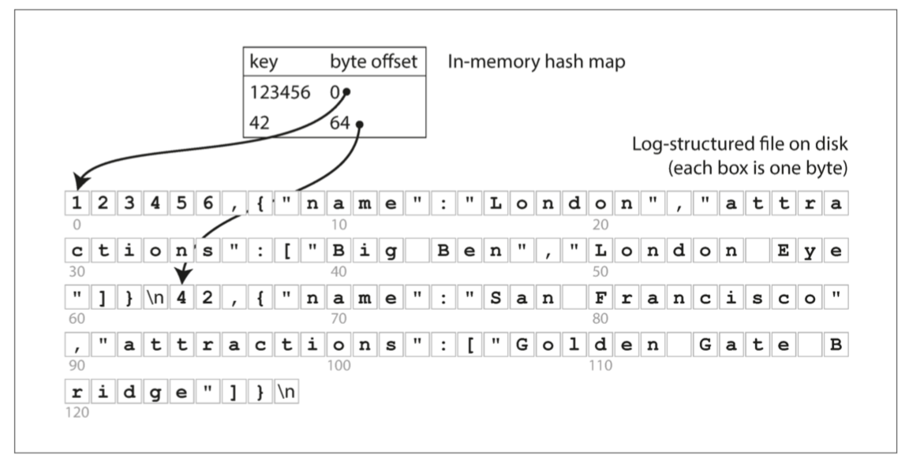
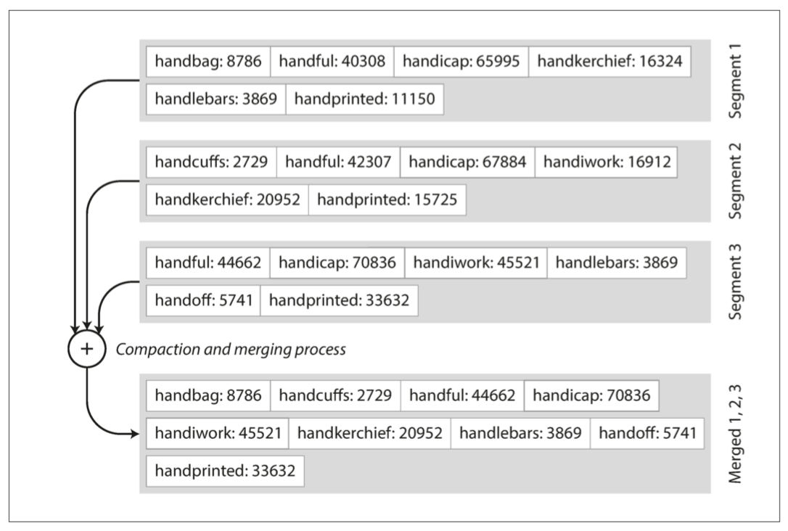

# Designing Data-Intensive Applications

- [Designing Data-Intensive Applications](#designing-data-intensive-applications)
  - [Data System Basic](#data-system-basic)
    - [1. One case in Twitter](#1-one-case-in-twitter)
    - [2. 应对负载增加的方法](#2-应对负载增加的方法)
    - [3. Data Model](#3-data-model)
    - [4. 声明式语言 vs 命令式语言](#4-声明式语言-vs-命令式语言)
    - [MapReduce Query](#mapreduce-query)
    - [Use RDS to Implement Graph Storage](#use-rds-to-implement-graph-storage)
    - [存储引擎](#存储引擎)
  - [References](#references)

## Data System Basic

现代软件系统大部分是`data-intensive`而不是`compute-intensive`,
而`data-intensive system`有三个重要的特性：Reliability, Scalability, Maintainability

### 1. One case in Twitter

考虑一个推特核心场景：
1. 发推文：平均 4.6k请求/秒，峰值超过 12k请求/秒
2. 看时间线：300k请求/秒 (用户关注的所有博主的按时间倒序发布的文章)

数据结构上有两种实现方式：
> 数据结构可参考localhost : designing_data_intensive_app

**The first solution**


The query for reading timeline:
```sql
    SELECT tweets.sender_id, tweets.text, tweets.`timestamp`
    FROM users
    JOIN follows ON users.id = follows.follower_id
    JOIN tweets ON follows.followee_id = tweets.sender_id
    WHERE users.screen_name = "Bob"
    ORDER BY tweets.`timestamp` DESC
```

By using this way, the QPS of writing into table `tweets` is 4.6k(the highest is 12k), and the QPS of reading from table`users follows tweets` is 300k. And the delay time is high.

**Another solution**


这个实现是在「读」timeline的时候加个cache(比如redis)，当一个用户发推时，会更新每个「followers」的时间线，这样会大大缩短「读」耗时

But the QPS of writing into cache would be very high. Every user has 75 followers in average, so the QPS would be `4.6k x 75 = 345k`.

**Easter Eggs**

最终推特采取了二合一的策略：
1. 普通用户发推，会采用method 2，实时更新其关注者的timeline
2. 大V(拥有很多粉丝)发推，采用method 1, 不实时更新cache，而是等着followers查看自己的timeline时再请求DataBase

### 2. 应对负载增加的方法

1. 垂直伸缩 Vertical Scaling 使用性能更强大的机器
2. 水平伸缩 Horizontal Scaling 将负载分摊在多个小机器上

### 3. Data Model

面向关系的数据库：Mysql PostgreSql

面向文档的数据库：[MongoDB](mongodb.md) RethinkDB CouchDB 使用JSON来表示存储结构

Popular Databases:
1. 关系型Database
2. 文档型Database
3. 图型Database


### 4. 声明式语言 vs 命令式语言

在特定场景下，声明式语言比命令式语言有很大的优势，比如Web:

```html
<ul>
    <li class="selected">
        <p>Sharks</p>
        <ul>
            <li>Great White Shark</li>
            <li>Tiger Shark</li>
            <li>Hammerhead Shark</li>
        </ul>
    </li>
    <li><p>Whales</p>
        <ul>
            <li>Blue Whale</li>
            <li>Humpback Whale</li>
            <li>Fin Whale</li>
        </ul>
    </li>
</ul>

```

如果像让选中的列表有一个蓝色的背景，可以用`CSS`这么写：
```css
li.selected > p {
	background-color: blue;
}

```

而如果使用`Javascript`来写则是这样的：
```js
var liElements = document.getElementsByTagName("li");
for (var i = 0; i < liElements.length; i++) {
    if (liElements[i].className === "selected") {
        var children = liElements[i].childNodes;
        for (var j = 0; j < children.length; j++) {
            var child = children[j];
            if (child.nodeType === Node.ELEMENT_NODE && child.tagName === "P") {
                child.setAttribute("style", "background-color: blue");
            }
        }
    }
}

```

Meanwhile, there are other advantages belowing:
1. 调用者只需要写出想要的数据类型、组合方式等信息，隐藏具体实现，方便后续在不更改接口的前提的情况下优化


### MapReduce Query

MapReduce is a coding model(编程模型), which process huge amount of data in multi machines

比如使用`MapReduce`来查询`mongodb`数据：

For example, two `documents`:
```json
    {
  observationTimestamp: Date.parse(  "Mon, 25 Dec 1995 12:34:56 GMT"),
  family: "Sharks",
  species: "Carcharodon carcharias",
  numAnimals: 3
}
{
  observationTimestamp: Date.parse("Tue, 12 Dec 1995 16:17:18 GMT"),
  family: "Sharks",
  species:    "Carcharias taurus",
  numAnimals: 4
}

```

使用JS的mapreduce方法来获得每个月观察到的鲨鱼的数量：
```js
db.observations.mapReduce(function map() {
        var year = this.observationTimestamp.getFullYear();
        var month = this.observationTimestamp.getMonth() + 1;
        emit(year + "-" + month, this.numAnimals);
    },
    function reduce(key, values) {
        return Array.sum(values);
    },
    {
        query: {
          family: "Sharks"
        },
        out: "monthlySharkReport"
    });

```

The specific steps:
1. 通过`query`来筛符合条件的`document`
2. 每个`document`跑一遍`map()`，上述两个document跑完得到的结果`emit("1995-12",3)`和`emit("1995-12",4)`
3. 到`reduce`这一步，参数`key`为`"1995-12"`，`values`为`[3,4]`，输出到document`monthlySharkReport`=7

### Use RDS to Implement Graph Storage

```sql
CREATE TABLE vertices (
  vertex_id  INTEGER PRIMARY KEY,
  properties JSON
);

CREATE TABLE edges (
  edge_id     INTEGER PRIMARY KEY,
  tail_vertex INTEGER REFERENCES vertices (vertex_id),
  head_vertex INTEGER REFERENCES vertices (vertex_id),
  label       TEXT,
  properties  JSON
);
```

### 存储引擎

目前常见的有两大类存储引擎：
1. log-structured
2. page-oriented

Use `bash` order to create the easiest sotrage:
```bash
#!/bin/bash
# xydb.sh
xyset () {
	echo "$1,$2" >> ~/Desktop/xydatabase
}

xyget () {
	grep "^$1," ~/Desktop/xydatabase | sed -e "s/^$1,//" | tail -n 1
}

```

And you can code in shell:
```bash
> source xydb.sh
> xyset lier '{"name":"Sis Lier","home":"London"}'
> xyget lier
> {"name":"Sis Lier","home":"London"}
```

这个最简单的数据库写入的时间复杂度还好，因为是文件尾追加写入的，但读取时间是O(n)，不太OK

Explain the Linux order:
1. `echo "xxx" >> zzz`: wirte xxx to append the end of zzz
2. `echo "xxx" > zzz`: write xxx to cover the content of zzz
3. `grep 'xxx' zzz`: 在zzz里查找xxx，并返回xxx所在的行：
   ```bash
    // zzz:
    apache,16
    bierson,22
    ciskpa,20

    // order:
    grep 'a' zzz

    // output:
    apache,16
    ciskpa,20
   ```
4. `grep '^xxx' zzz`: 查找以xxx开头的行
5. `sed -e 's/xxx/yyy/'` 把管道的每行数据的第一个xxx替换为yyy(`sed`前一般有`grep|nl`命令)
6. `sed -e 's/xxx/yyy/g'` 把管道的每行数据的所有xxx替换为yyy
7. `tail -n 1` 显示管道尾部最下的1行数据

因为O(n)的时间复杂度很难让人接受，所以需要用到索引Index

Similarly, let's see the easiest way to make `Index`



把每个记录的在文件中的`offset`存进内存，然后读磁盘的时候直接根据偏移量读数据(like the linux order `pread`)

那么如何解决日志`log`过长造成磁盘耗尽呢，就需要把log分段`segment`处理，在合适的时机把段进行压缩`compress`和合并`merge`
> 这里的`log`不仅仅是作为“日志”使用，其本身就是存储数据的地方


这样每个段都有一个对应的内存哈希`Index`，当要query一个键的时候，从最新段的内存哈希查有没有查询的key，如果有就直接根据内存哈希的offset来从磁盘取数据，
如果没有再查看第二新的段，以此类推

The more efficient way of compressing and merging:

使用`SSTable(Sorted String Table)`，把每个段的数据按照键来排序：
   
`SSTable`除了可以提升merge效率，还有一个好处是内存哈希可以不用存该段的所有的key，
因为是排好序的只要找到所需key所在的区间就可以了
   

Now, our easy storage engine is done:

1. 写入时先写入内存(红黑树)，当超过一定阈值(比如几兆)，将内存缓存以`SSTable`格式写入磁盘，因为红黑树可以按顺序读，所以写入磁盘的段也是按顺序的
2. 起新的内存缓存并重复1步骤，同时在一定时机将磁盘执行压缩和合并工作
3. 读取时按照内存缓存的新旧顺序读取

这个方案有一个问题，就是当崩溃时最新的还没落磁盘的内存缓存的数据会丢失，
这就需要有一个专门的日志来执行崩溃后的恢复工作，这个日志类似于存储数据的日志，
但是当有段落磁盘成功时可以将旧的日志删掉

Above storage engin is named as `LSM` storage engin which is involved in `LevelDB` and `RocksDB`

但`LSM`也有问题，查询最差的情况下你必须从最新的段读到最旧的段(如果内存缓存不存所有的key的话)，所以通常要额外加个Bloom过滤器

## References
1. https://github.com/Vonng/ddia