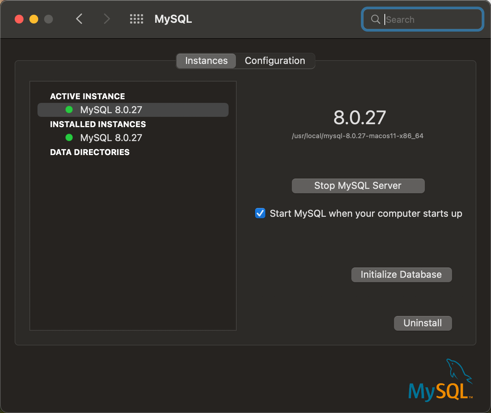
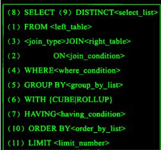

# Mysql

- [Mysql](#mysql)
  - [Mysql In MacOS](#mysql-in-macos)
  - [Mysql Order](#mysql-order)
    - [Especial Order](#especial-order)
  - [Mysql Basic](#mysql-basic)
    - [Mysql 命令的执行顺序](#mysql-命令的执行顺序)
  - [References](#references)

## Mysql In MacOS

mysql程序所在目录：`/usr/local/mysql`

mysql二进制执行文件：`/usr/local/mysql/bin/mysql`

mysql加入PATH，在`~/.zshrc`中添加`export PATH=$PATH:/usr/loca/mysql/bin/mysql`

mysql的后台进程管理：


The default mysql databases:
```
mysql> show databases;
+--------------------+
| Database           |
+--------------------+
| information_schema |
| mysql              |
| performance_schema |
| sys                |
+--------------------+
```

Mysql Version is `8.0.27`

## Mysql Order

1. connect mysql in local machine: `mysql -u root -p`


### Especial Order

**1. group by ... with rollup**

除了可以输出指定的聚合条件，还能顺便把每个聚合列都单独输出一遍，比如：

```sql
INSERT INTO sales (year, country, product, profit) VALUES
    (2000, 'Finland', 'Computer', 500),
    (2000, 'Finland', 'Computer', 1000),
    (2000, 'India', 'Calculator', 150),
    (2000, 'India', 'Computer', 400),
    (2000, 'Finland', 'Phone', 100),
    (2001, 'USA', 'Calculator', 50),
    (2001, 'USA', 'Computer', 2700),
    (2001, 'USA', 'TV', 1),
    (2000, 'India', 'Computer', 300),
    (2000, 'India', 'Computer', 500),
    (2000, 'USA', 'Calculator', 75),
    (2000, 'USA', 'Computer', 1500),
    (2001, 'USA', 'TV', 249),
    (2001, 'Finland', 'Phone', 10);
```

如果要查询每个地区、每年的总销售额，可以
```sql
SELECT year, country, product, SUM(profit) AS profit
       FROM sales
       GROUP BY year, country, product;
```

The output is:
```sql
+------+---------+------------+--------+
| year | country | product    | profit |
+------+---------+------------+--------+
| 2000 | Finland | Computer   |   1500 |
| 2000 | India   | Calculator |    150 |
| 2000 | India   | Computer   |   1200 |
| 2000 | Finland | Phone      |    100 |
| 2001 | USA     | Calculator |     50 |
| 2001 | USA     | Computer   |   2700 |
| 2001 | USA     | TV         |    250 |
| 2000 | USA     | Calculator |     75 |
| 2000 | USA     | Computer   |   1500 |
| 2001 | Finland | Phone      |     10 |
+------+---------+------------+--------+
```
可以看到聚合条件是 `year+country+product`，表示这三个列聚合在一起表示一个唯一的行ID，而`with rollup`则可以显示更低级别的聚合：
1. `year+country`
2. `country+product`
3. `year+product`
4. `year`
5. `country`
6. `product`
7. `NULL` 所有的行在一组

The `with rollup` output is:
```sql 
+------+---------+------------+--------+
| year | country | product    | profit |
+------+---------+------------+--------+
| 2000 | Finland | Computer   |   1500 |
| 2000 | Finland | Phone      |    100 |
| 2000 | Finland | NULL       |   1600 |
| 2000 | India   | Calculator |    150 |
| 2000 | India   | Computer   |   1200 |
| 2000 | India   | NULL       |   1350 |
| 2000 | USA     | Calculator |     75 |
| 2000 | USA     | Computer   |   1500 |
| 2000 | USA     | NULL       |   1575 |
| 2000 | NULL    | NULL       |   4525 |
| 2001 | Finland | Phone      |     10 |
| 2001 | Finland | NULL       |     10 |
| 2001 | USA     | Calculator |     50 |
| 2001 | USA     | Computer   |   2700 |
| 2001 | USA     | TV         |    250 |
| 2001 | USA     | NULL       |   3000 |
| 2001 | NULL    | NULL       |   3010 |
| NULL | NULL    | NULL       |   7535 |
```

**2. join...on**
`join` makes two tables into one, and there are three different `join` method:

1. `inner join` equals to `join`, which only get data mathching the `on` condition, like:
   ```sql
    select a.id, b.name from a join b on a.id = b.id
   ```

   it's equal to that:
   ```sql
    select a.id, b.name from a, b where a.id = b.id
   ```

2. `left join` order gets all left table's data and matching `on` condition's right table's data
3. `right join` is the same as above but shows all right table's data


## Mysql Basic

### Mysql 命令的执行顺序



> mysql每一步都会产生一个虚拟表，只有最后一个虚拟表返回给用户

1. `from...(inner/left/right)join...on` is the first step to create a temporary table(VT1) using condition `on`
2. `where...` is the second step to evaluate all rows according the `where` conditions to determine every row should be discared or retained(VT2)
3. `group by...(with rollup)` is the 3rd step to create VT3
4. `having...` like `having count(*) > 20`, in which you can see the condition of `having` must be operation on `group`
5. `select...` is the step to select specific columns
6. `order by...(desc)` is just as its name implies
7. `limit...(offset...)` acts like cursor and count


## References
1. https://qxf2.com/blog/mysql-query-execution/